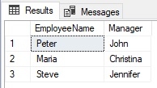

## SQL Server Exercise 

### Subqueries & Joins

In this exercise you have to write SQL statements to Create, Alter & Drop Stored Procedures

Note: Download & execute the attached script in SQL Server to create database and tables for this exercise.
[Download script here](./script.sql)

1. Write a query to find the second highest `UnitPrice` from Products table.
2. Write a query to find the records of the products where `UnitPrice` is greater than the maximum `UnitsInStock` value.
3. Write a query to display the complete record of the Product where `UnitPrice` is second highest.
4. Write a query to find all records from `Customers` and `Orders` table where `CustomerID` is common.
5. Write a query to find all records from `Customers` and only those records from `Orders` whose `CustomerID` is common with `Customers` table `CustomerID`.
6. In `Employees` table there are three columns - EmployeeId, EmployeeName & MgrId. MgrId is ManagerId. Each employee reports to the corresponding manager with respective MgrId. Write a query to display records from `Employees` table so that the names of the Employee and Manager should be displayed side by side based on which Employee reports to which Manager. The expected output is shown below in the screenshot. Hint: you have to use self join.

